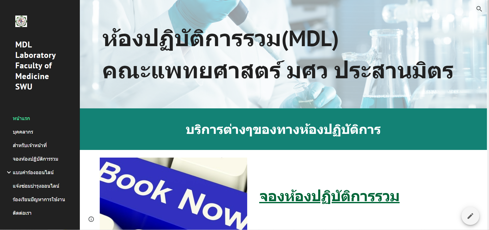

# MDL Laboratory Website Project
- สวัสดีครับ ยินดีต้อนรับสู่โปรเจค **" MDL Laboratory Website "** โดยโปรเจคนี้เป็นโปรเจคแรกในสายงานด้าน Data ของผมเอง จุดเริ่มต้นมาจากในปี 2021 ขณะนั้นทำงานเป็นนักวิทยาศาสตร์ อยู่ที่มหาวิทยาลัยศรีนครินทรวิโรฒ เนื่องจากระบบการทำงานแบบดั้งเดิมใช้การบันทึกข้อมูลลงในกระดาษซึ่งเสี่ยงต่อการตกหล่นของข้อมูล จึงได้ทำการสร้างเว็บไซต์ขึ้นมาโดยใช้บริการของ **Google site**

- ภายในเว็บไซต์มีฟีเจอร์หลักๆ คือ **ระบบการจองห้องแลป** , **ระบบการยืม-คืนอุปกรณ์วิทยาศาสตร์** , **ระบบแจ้งซ่อม** เป็นต้น ซึ่งฟีเจอร์เหล่านี้พัฒนาขึ้นโดยการใช้งาน **Google form** , **Google sheet** , **Google calendar** , **Autocrat extension** , **Appscript** และ **Line notify** จนออกมาเป็นฟีเจอร์ที่ต้องการ

- นอกจากนี้ยังมีการเขียนโค้ดด้วยภาษา Javascript ใน Appscript เพื่อให้ได้การทำงานของโปรแกรมตามที่ต้องการและเนื่องจากเป็นการเขียนโปรแกรมครั้งแรกในชีวิต จึงใช้การจินตนาการภาพในหัวถึงฟังก์ชั่นการทำงานของโปรแกรมที่ต้องการ หลังจากนั้นจึงไปค้นหาโค้ดตามแหล่งต่างๆใน google ก่อนนำมาประกอบเข้าด้วยกัน สุดท้ายเขียนโค้ดด้วยตนเองใจุดที่ไม่สามารถหาได้จาก google เป็นอันเสร็จเรียบร้อย

- หลังจากฟีเจอร์ต่างๆเสร็จเรียบร้อยแล้ว ก็เริ่มดำเนินการทดสอบโปรแกรมเพื่อให้ได้ผลลัพธ์ตามที่ต้องการ ซึ่งตรงจุดนี้เป็นเนื้องานของการทำ **" Software Tester "** แต่ในกรณีนี้จะไม่มีการเขียน Test case สำหรับดำเนินการทดสอบ หลักๆแล้วจะทำการทดสอบฟีเจอร์ **การจองห้อง** กับ **การยืม-คืนคืนอุปกรณ์วิทยาศาสตร์** เป็นหลักโดยปัญหาที่พบ คือ การแสดงผลข้อมูลในกลุ่ม Line ที่ดึงข้อมูลจาก Google sheet ไปแสดงโดยผ่าน API เมื่อทดสอบเรียบร้อยก็พร้อมสำหรับการใช้งานจริง