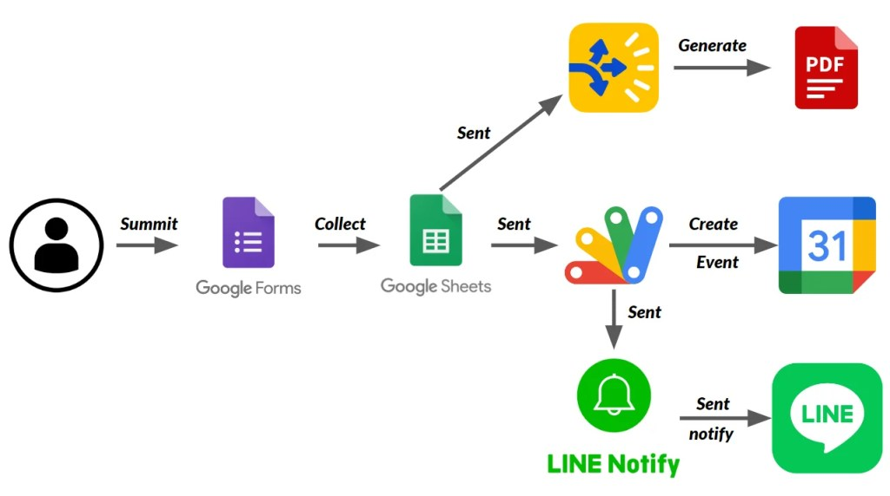
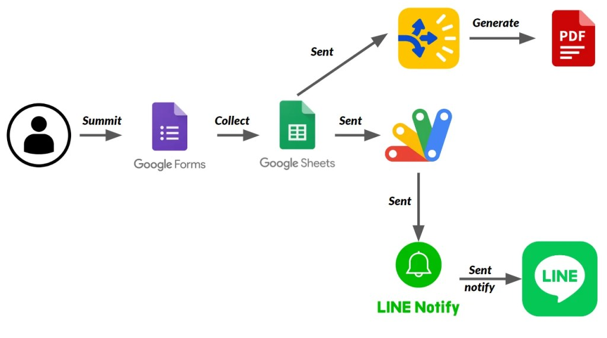
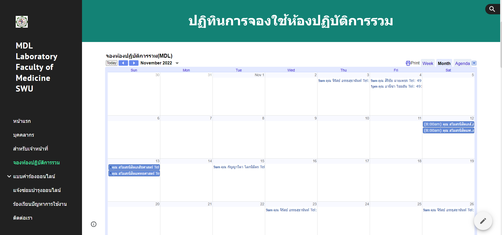
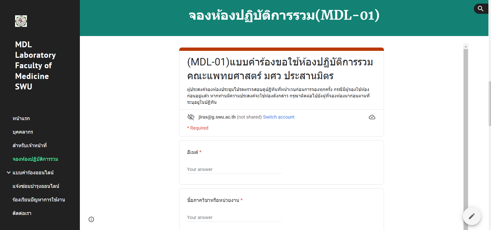
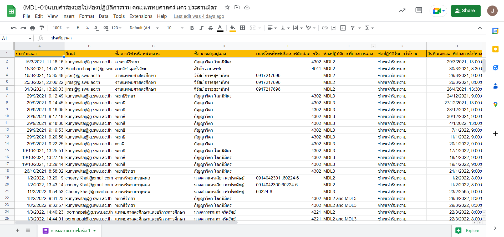

# MDL-Laboratory-Website-Project

In the old system my laboratory has use paper to collect a data. It’s not convenient when you want to see a summary result. When i working first day, i see this problem from old system and planing to create a new system for laboratory. It must easy to use and rapid for fixed when a website has a problem .

New system i use google site to create the website. It very easy to use because google developer has create this solution for non-programmer, you can create website with low-coding tool.

See My Laboratory Website [click](https://sites.google.com/g.swu.ac.th/mdllaboratory-med-swu/%E0%B8%AB%E0%B8%99%E0%B8%B2%E0%B9%81%E0%B8%A3%E0%B8%81?authuser=2)

# Tools :

- Google Site
- Google Form
- Google Sheet
- Google Apps Script
- Line Notify
- Autocrat (Google Sheet plugin)

# FunctionStructure

- Booking Function

 
- Online form

 
# Interface Website

- Home Page

- Booking Calendar

- Online Booking Form

- Collect data in Spreadsheets

